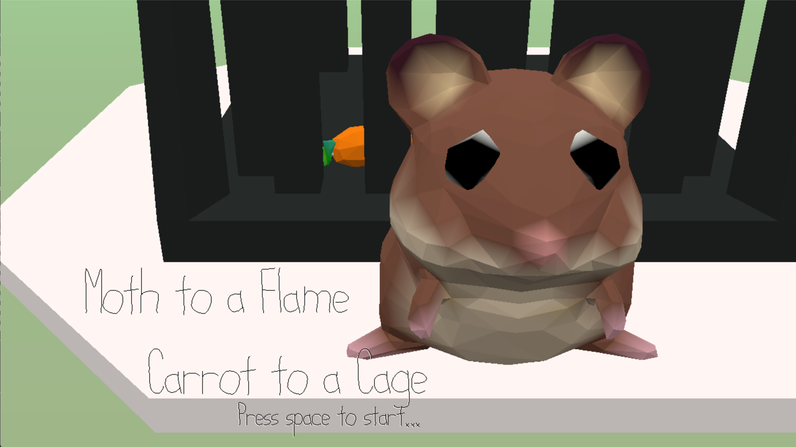
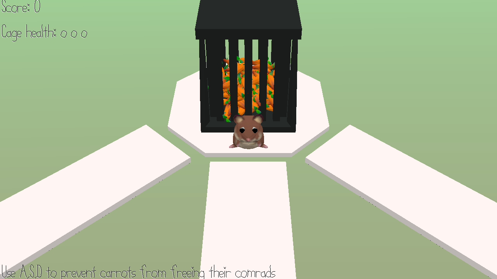

# Moth to a Flame, Carrot to a Cage

Author: Weiwen "Andy" Jiang

Design: Hamster is tired of chasing carrots around, its time to bait them in... Press the corresponding button when hearing the sound cue to capture the incoming carrots! Don't let them reach the end or else the bait might run free.

Screen Shot:

How To Play:

There are 3 lanes, left, middle, and right, which correspond to A, S, and W keys. When you hear the sound cue representing a lane, it means a carrot is trying to break in from that lane! Press the corresponding button and capture them! You cannot hold down the A, S, or W keys at the same time, or else you do not capture in any lane. The cage has 3 health, if it loses all three health, the carrots escape!

This game was built with [NEST](NEST.md).
